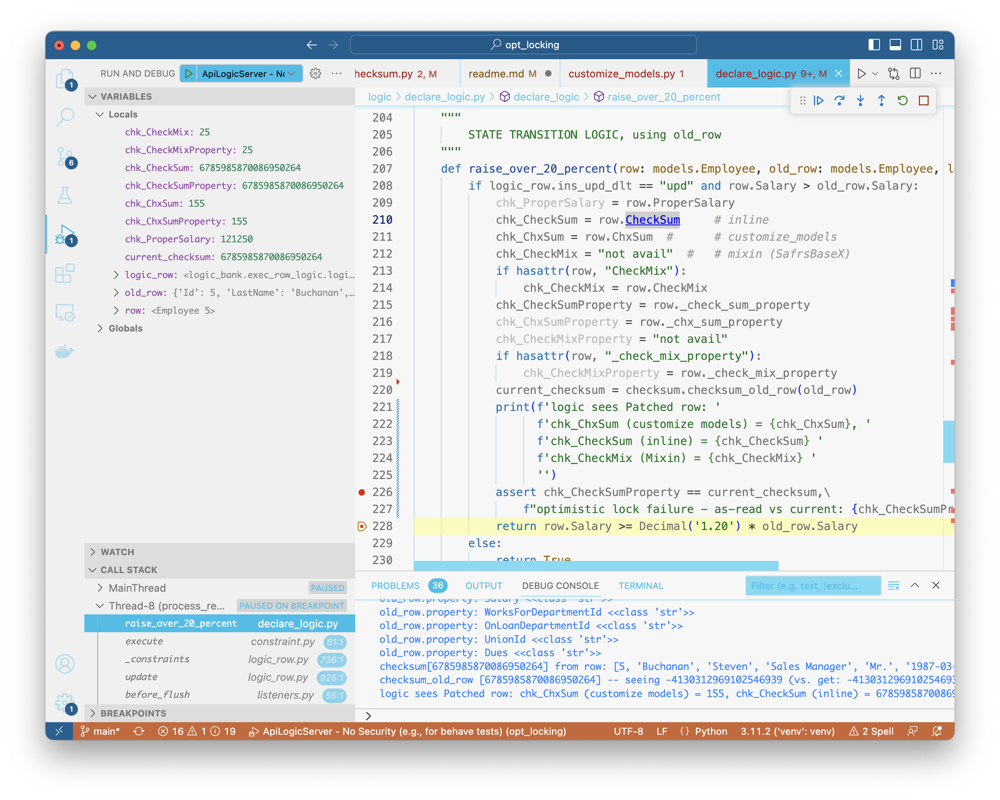

Optimistic locking is a valuable feature.  It is a blocker for companies who might otherwise migrate to API Logic Server from CA Live API Creator.  [This project](https://github.com/valhuber/opt_locking) explores approaches. 

&nbsp;

## TL;DR - Compute virtual attribute `CheckSum` in `loaded_as_persistent`, verify on save

We want **virtual attributes** that can be computed on retrieval, not stored in the database, and attached to API rows as they are sent / returned from the client.  The returned `CheckSum` can then be tested (in logic) to make sure it was unchanged.

1. SQLAlchemy provides the `loaded_as_persistent` event, enabling us to compute the `CheckSum`, store it in the row, and check it on update.

    * Storing it in the row is critical because we do not want to maintain server state between client calls.  Nor do we want to force customers to include special fields in their schema.<br><br>

2. For virtual attributes, we can use `@jsonapi_attr`.

3. Clients must include the as-read-checksum (virtual attribute) in the `Patch`

4. Logic will verify that the as-read-checksum equals the current-checksum

&nbsp;

## 1. Event `loaded_as_persistent` (works)

[This event](https://docs.sqlalchemy.org/en/20/orm/events.html#sqlalchemy.orm.SessionEvents.loaded_as_persistent) looks like this (see `api/system/opt_locking.py`):

```python
        elif isinstance(instance, models.Employee):
            logger.debug(f'{__name__} - setting CheckSum in EMP instance: {instance}')
            checksum_value = checksum.checksum_row(instance)
            print(f'checksum_value: {checksum_value}')
            setattr(instance, "_check_sum_property", checksum_value)
```

We set_up the listener (`opt_logic_setup`) in `api_logic_server_run.py`.

&nbsp;

### Alternative: compute _check_sum_ in attr getter

This might also work...?

&nbsp;

## 2. safrs `@jsonapi_attr` for `CheckSum` virtual attribute

This provides a mechanism to define attributes as part of the row (so it sent to / returned from the client), and not saved to disk.  

The question is: ***where can this declaration be made.***  Options are discussed below.

1. In `database/models.py` -- **inline**, in `Employees`
    * **works**
2. In `database/models.py` -- in super class `SafrsBaseX`
    * not working
3. In `database/customize_models.py`
    * not working - not marshalled on patch (same for ProperSalary)

So, looks like the **inline** option is the only one that works.

&nbsp;

## 3. Clients include read-checksum in `Patch`

**Important:** Admin App is not sending unchanged attributes; we must convince it to send the CheckSum.

To simulate the client:
1. Set the breakpoint noted below, and 
2. Use cURL (easiest) or swagger (note: this should fail with constraint violation):

```curl
curl -X 'PATCH' \
  'http://localhost:5656/api/Employee/5/' \
  -H 'accept: application/vnd.api+json' \
  -H 'Content-Type: application/json' \
  -d '{
    "data": {
        "attributes": {
            "Salary": 97000,
            "ChkSum": 6785985870086950265,
            "CheckSum": 6785985870086950264,
            "CheckMix": 6785985870086950266,
            "Proper_Salary": 50000,
            "Id": 5},
        "type": "Employee",
        "id": 5
    }
}'
```

Here is a patch for table with no CheckSum, to test optional OptLocking
```
curl -X 'PATCH' \
  'http://localhost:5656/api/Customer/ALFKI/' \
  -H 'accept: application/vnd.api+json' \
  -H 'Content-Type: application/json' \
  -d '{
  "data": {
    "attributes": {
      "CompanyName": "x"
    },
    "type": "Customer",
    "id": "ALFKI"
  }
}'
```

Not visible on update: ChkSum, CheckMix
> Patch base @ 305, confirm: print(f'Safrs DEBUG - not in self.__class__._s_jsonapi_attrs: {attr_name}')
Visible: CheckSum
> Verified not seeing *checksum override* by using "CheckSum": "6785985870086950264-xx", -- properly raises "opt lock failure"


Get (6785985870086950264):

```
curl -X 'GET' \
  'http://localhost:5656/api/Employee/5/?fields%5BEmployee%5D=Id%2CLastName%2CFirstName%2CTitle%2CTitleOfCourtesy%2CBirthDate%2CHireDate%2CAddress%2CCity%2CRegion%2CPostalCode%2CCountry%2CHomePhone%2CExtension%2CNotes%2CReportsTo%2CPhotoPath%2CEmployeeType%2CSalary%2CWorksForDepartmentId%2COnLoanDepartmentId%2CUnionId%2CDues%2C_check_sum_%2CCheckSum%2C__proper_salary__%2CProperSalary%2C_chx_sum_%2CChxSum' \
  -H 'accept: application/vnd.api+json' \
  -H 'Content-Type: application/vnd.api+json'
```
&nbsp;


Test unmodelled attr -- ToDict_Checksum is not marshalled into row on update

```
curl -X 'PATCH' \
  'http://localhost:5656/api/Employee/5/' \
  -H 'accept: application/vnd.api+json' \
  -H 'Content-Type: application/json' \
  -d '{
    "data": {
        "attributes": {
            "Salary": 200000,
            "_chx_sum_property": 157,
            "_check_sum_property": 6785985870086950264,
            "_check_mix_property": 27,
            "ToDict_Checksum": 42,
            "ChkSum": 157,
            "CheckSum": 57,
            "CheckMix": 27,
            "Proper_Salary": 50000,
            "Id": 5},
        "type": "Employee",
        "id": 5
    }
}'
```

&nbsp;

#### Approach works with logical (not db) names

Also verified works with alias Entity / Attr names, using Category (-4130312969102546939)

```
curl -X 'GET' \
  'http://localhost:5656/api/Category/1/?fields%5BCategory%5D=Id%2CCategoryName%2CDescription%2CClient_id%2C_check_sum_%2CCheckSum' \
  -H 'accept: application/vnd.api+json' \
  -H 'Content-Type: application/vnd.api+json'
```

```
curl -X 'PATCH' \
  'http://localhost:5656/api/Category/1/' \
  -H 'accept: application/vnd.api+json' \
  -H 'Content-Type: application/json' \
  -d '{
  "data": {
    "attributes": {
      "Description": "x",
      "CheckSum": "-4130312969102546939"
    },
    "type": "Category",
    "id": "1"
  }
}'
```

&nbsp;

## 4. Check `CheckSum` in logic

We can test the various strategies, as follows:

1. Set breakpoint as shown in `logic/declare_logic.py`
2. Use Run Config `ApiLogicServer - No Security`
3. Simulate the client using the first cURL above
4. Observe the logged values - the **inline** approach appears to work

```log
logic sees Patched row: chk_ChxSum (customize models) = 155, chk_CheckSum (inline) = 6785985870086950264 chk_CheckMix (Mixin) = 25 
```



---

&nbsp;

## Appendix: Other Options Considered for `@json_attr` definition

Skip this for now, it just documents other rejected approaches.

&nbsp;

### Option 1: Declare in subclass (but fails in logic)

It would not be difficult to generate current models with the suffix `_base`, then sublcass all these models in a customer-alterable file, initially empty.  

However, this failed, since LogicBank uses simple mechanisms to find attributes and relationships.  This might be an extensive change.

&nbsp;

### Option 2: Declare in mixin (but safrs fails to recognize property)

Other approach is to generate models like this:

```python
class Employee(SAFRSBase, Base, models_mix.Employee_mix):
```

where `database/models_mix.Employee_mix` is a user-alterable (not rebuilt) file that defines virtual attributes (`_check_mix_`).  

However, this ***does not appear to work*** for `@jsonapi_attr` -- it is not called when retrieving rows, and `ProperSalary` does not appear in swagger.  

Also, a flawed in that the dynamic `@add_method(cls)` is not generic... what `cls` should be passed to add_method?

Unclear how to resolve.

### Option 3: `@jsonapi_attr` in `customize_models.py`

See `add_method.py`, courtesy: https://mgarod.medium.com/dynamically-add-a-method-to-a-class-in-python-c49204b85bd6

Appears to work, attractive since requires no change to models.py (so can rebuild-from-database).

Though, `_check_sum_property` appears as an attr in json response.  

> This can be resolved by overriding `SAFRSBase`, as illustrated in `database/models.py`.

This was rejected because while retrieval works, such attrs are merged into update rows:

> Patch base @ 305, confirm: print(f'Safrs DEBUG - not in self.__class__._s_jsonapi_attrs: {attr_name}')

&nbsp;

### Option 3: declare in super type

Got error: `metaclass conflict: the metaclass of a derived class must be a (non-strict) subclass of the metaclasses of all its bases`


