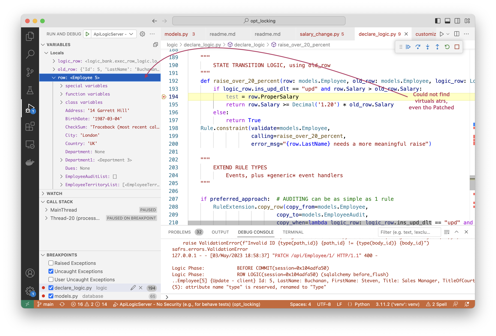

Optimistic locking is a valuable feature.  It is a blocker for companies who might otherwise migrate to API Logic Server from CA Live API Creator.  [This project](https://github.com/valhuber/opt_locking) explores approaches. 

&nbsp;

## TL;DR - Compute virtual attribute `__check_sum__` in `loaded_as_persistent`, verify on save

SQLAlchemy provides the `loaded_as_persistent` event, enabling us to compute the `check_sum`, store it in the row, and check it on update.

Storing it in the row is critical because we do not want to maintain server state between client calls.  Nor do we want to force customers to include special fields in their schema.

We want **virtual attributes** that can be computed on retrieval, not stored in the database, and attached to API rows as they are sent / returned from the client.  The returned `__check_sum__` can then be tested (in logic) to make sure it was unchanged.

For virtual attributes, we can use `@jsonapi_attr`.

Declaring this *virtual attribute* is a key focus of this exploratory prototype.

This works, ***except*** that the virtual attributes are not returned on Patch commands.  See "Failing", below.

&nbsp;

## Event `loaded_as_persistent` (works)

[This event](https://docs.sqlalchemy.org/en/20/orm/events.html#sqlalchemy.orm.SessionEvents.loaded_as_persistent) looks like this (see `logic/sys_logic.py`):

```python
    @event.listens_for(session, `loaded_as_persistent`)
    def receive_loaded_as_persistent(session, instance):
        "listen for the 'loaded_as_persistent' event"

        logger.debug(f'{__name__} - compute __check_sum__')
```

We set up the listener in `api_logic_server_run.py`.

&nbsp;

### Alternative: compute __check_sum__ in attr getter

This should also work.

&nbsp;

## safrs `@jsonapi_attr` (works - where to define?)

This provides a mechanism to define attributes as part of the row (so it sent to / returned from the client), and not saved to disk.  

The question is: ***where can this declaration be made.***  Options are discussed below.

&nbsp;

### Chosen Option: Add Dynamic Method

See `add_method.py`, courtesy: https://mgarod.medium.com/dynamically-add-a-method-to-a-class-in-python-c49204b85bd6

Appears to work, most preferable since requires no change to models.py (so can rebuild-from-database).

Though, `__proper_salary__` appears as an attr in json response.  

> This can be resolved by overriding `SAFRSBase`, as illustrated in `database/models.py`.

&nbsp;

## Check `__check_sum__` in logic - *FAILING*

This is ***failing***, since jsonapi_attr values are not sent on `Patch`.  We can test both `__check_sum__` and `Proper_Salary`, as follows:

1. Set breakpoint @194 in `logic/declare_logic.py`
2. Use Run Config `ApiLogicServer - No Security`
3. In Swagger, **Employee/Patch** the following for **id 5**:

```json
{
    "data": {
        "attributes": {
            "Salary": 200000,
            "__check_sum__": 72,
            "Proper_Salary": 50000,
            "Id": 5},
        "type": "Employee",
        "id": 5
    }
}
```
&nbsp;


---

&nbsp;

### Appendix: Other Options Considered for `@json_attr` definition

Skip this for now, it just documents other rejected approaches.

&nbsp;

#### Option 1: In models.py (but rebuild issues)

It works to append the following code to `Employee in database/models.py`:

```python
    from safrs import jsonapi_attr
    # add derived attribute: https://github.com/thomaxxl/safrs/blob/master/examples/demo_pythonanywhere_com.py
    @jsonapi_attr
    def proper_salary(self):  # type: ignore [no-redef]
        import database.models as models
        if isinstance(self, models.Employee):
            import decimal
            rtn_value = self.Salary
            rtn_value = decimal.Decimal('1.25') * rtn_value
            self._proper_salary = int(rtn_value)
            return self._proper_salary
        else:
            print("class")
            return db.Decimal(10)

    @proper_salary.setter
    def proper_salary(self, value):  # type: ignore [no-redef]
        self._proper_salary = value
        print(f'_proper_salary={self._proper_salary}')
        pass

    ProperSalary = proper_salary  # signal safrs to recognize this as api-visible property
```

However, that is not ideal... if `models.py` is rebuilt-from-model, these changes are lost.  I then looked into options 2 and 3...


    Note:  of 08.02.04, nw is created with that code (currently checked in to main).

&nbsp;

#### Option 2: Declare in subclass (but fails in logic)

It would not be difficult to generate current models with the suffix `_base`, then sublcass all these models in a customer-alterable file, initially empty.  

However, this failed, since LogicBank uses simple mechanisms to find attributes and relationships.  This might be an extensive change.

&nbsp;

#### Option 3: Declare in mixin (but safrs fails to recognize property)

Other approach is to generate models like this:

```python
class Employee(SAFRSBase, Base, models_mix.Employee_mix):
```

where `database/models_mix.Employee_mix` is a user-alterable (not rebuilt) file that defines virtual attributes.  

However, this ***does not appear to work*** for `@jsonapi_attr` -- it is not called when retrieving rows, and `ProperSalary` does not appear in swagger.

**Explored in this hand-altered prototype.**
